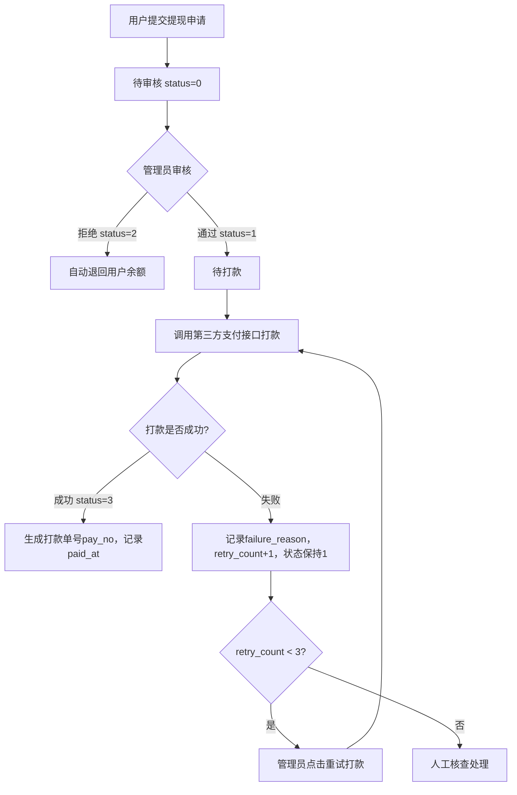
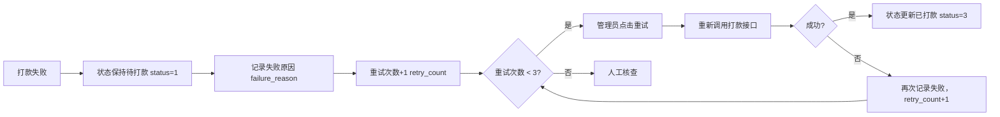

# 提现管理

## 1. 页面概述
提现管理处理用户提现申请的审核、打款全流程，支持审核通过/拒绝（拒绝时自动退回余额）、打款、打款失败重试、提现限额配置。

### 核心指标
| 指标 | 含义 |
|------|------|
| 待审核笔数 | status=0的提现单数量 |
| 待审核金额 | status=0的提现单actual_amount总和 |
| 已打款笔数 | status=3的提现单数量 |

### 使用场景
1. 审核提现：管理员审核用户提现申请，通过或拒绝
2. 打款处理：审核通过后，调用第三方支付接口打款
3. 打款失败重试：第三方接口异常时，记录失败原因，支持重试（最多3次）
4. 提现限额配置：配置单笔最低/最高提现额、每日提现次数限制

## 2. API接口清单

### 管理端
| 方法 | 路径 | 控制器方法 | 说明 |
|------|------|-----------|------|
| GET | /api/v1/admin/user-center/withdraws | UserCenterController@withdraws | 提现列表（分页+筛选+3项统计） |
| POST | /api/v1/admin/user-center/withdraws/{id}/audit | UserCenterController@withdrawAudit | 审核提现（1通过/2拒绝，拒绝时自动退回余额） |
| POST | /api/v1/admin/user-center/withdraws/{id}/pay | UserCenterController@withdrawPay | 打款（支持is_fail参数模拟失败） |
| POST | /api/v1/admin/user-center/withdraws/{id}/retry | UserCenterController@withdrawRetry | 重试打款（最多3次，支持is_fail参数） |
| GET | /api/v1/admin/user-center/withdraws/settings | UserCenterController@withdrawSettings | 读取提现限额配置 |
| PUT | /api/v1/admin/user-center/withdraws/settings | UserCenterController@withdrawSettings | 更新提现限额配置 |

## 3. 请求参数

### 提现列表
| 参数 | 类型 | 必填 | 说明 |
|------|------|------|------|
| page | int | 否 | 页码默认1 |
| limit | int | 否 | 每页数量默认20 |
| status | int | 否 | 状态筛选（0待审核1待打款2已拒绝3已打款） |
| keyword | string | 否 | 关键词（用户昵称/手机号/打款账户） |

### 审核提现
| 参数 | 类型 | 必填 | 说明 |
|------|------|------|------|
| status | int | 是 | 审核结果（1通过/2拒绝） |
| audit_remark | string | 否 | 审核备注 |

### 打款/重试打款
| 参数 | 类型 | 必填 | 说明 |
|------|------|------|------|
| is_fail | int | 否 | 是否模拟打款失败（0成功1失败，默认0） |
| failure_reason | string | 否 | 打款失败原因（is_fail=1时有效） |

### 更新提现限额配置
| 参数 | 类型 | 必填 | 说明 |
|------|------|------|------|
| min_withdraw_amount | string | 否 | 单笔最低提现金额（默认1元） |
| max_withdraw_amount | string | 否 | 单笔最高提现金额（默认50000元） |
| daily_withdraw_limit | string | 否 | 每日提现次数限制（默认3次） |

## 4. 返回示例

### 打款失败
```json
{
  "code": 400,
  "message": "打款失败：支付宝接口超时",
  "data": null
}
```

### 重试打款成功
```json
{
  "code": 200,
  "message": "重试打款成功",
  "data": {"pay_no": "PAY202609020312515688", "retry_count": 2}
}
```

### 提现限额配置
```json
{
  "code": 200,
  "data": {
    "min_withdraw_amount": {"name": "单笔最低提现金额", "value": "10", "type": "number"},
    "max_withdraw_amount": {"name": "单笔最高提现金额", "value": "100000", "type": "number"},
    "daily_withdraw_limit": {"name": "每日提现次数限制", "value": "5", "type": "number"}
  }
}
```

## 5. 字段映射表

### withdraws表（22字段，P0新增2字段）
| 字段 | 类型 | 说明 |
|------|------|------|
| id | bigint | 主键 |
| user_id | bigint | 用户ID |
| merchant_id | bigint | 商家ID（预留） |
| type | tinyint | 提现类型（1用户提现） |
| amount | decimal(12,2) | 提现金额 |
| fee | decimal(12,2) | 手续费 |
| actual_amount | decimal(12,2) | 实际到账金额（amount-fee） |
| pay_type | varchar(50) | 打款方式（alipay/wechat/bank） |
| pay_account | varchar(255) | 打款账户 |
| real_name | varchar(50) | 真实姓名 |
| status | tinyint | 状态（0待审核1待打款2已拒绝3已打款） |
| audit_remark | varchar(255) | 审核备注 |
| audit_at | timestamp | 审核时间 |
| admin_id | bigint | 操作管理员ID |
| paid_at | timestamp | 打款时间 |
| pay_no | varchar(100) | 打款单号 |
| failure_reason | varchar(255) | 打款失败原因（P0新增） |
| retry_count | int | 打款重试次数（P0新增，默认0，最多3次） |
| created_at | timestamp | 创建时间 |
| updated_at | timestamp | 更新时间 |

### system_configs表（提现限额配置，group='withdraw'）
| key | 说明 | 默认值 |
|-----|------|--------|
| min_withdraw_amount | 单笔最低提现金额 | 1元 |
| max_withdraw_amount | 单笔最高提现金额 | 50000元 |
| daily_withdraw_limit | 每日提现次数限制 | 3次 |

## 6. 操作流程

### 提现审核-打款完整流程


### 打款失败重试流程


## 7. 权限控制
- 认证：Sanctum Token
- 中间件：auth:sanctum
- 管理端：登录管理员可操作
- 审核/打款/重试均记录admin_id，可追溯操作人

## 8. 关联模块
| 模块 | 关联内容 | 字段 |
|------|----------|------|
| 用户管理 | 用户余额（拒绝提现时退回） | users.balance |
| 账户日志 | 余额变动记录（提现退回） | user_balance_logs |
| 系统配置 | 提现限额配置 | system_configs (group=withdraw) |

## 9. 验收清单
- [x] 提现列表正常加载（分页+筛选+3项统计）
- [x] 审核通过正常（status 0→1）
- [x] 审核拒绝正常（status 0→2，自动退回用户余额）
- [x] 重复审核防护（已处理的提现单报错提示）
- [x] 打款成功正常（status 1→3，生成pay_no，记录paid_at）
- [x] 打款失败处理正常（status保持1，记录failure_reason，retry_count+1）
- [x] 重试打款成功正常（status 1→3，生成新pay_no）
- [x] 重试次数限制（retry_count>=3时报错，提示人工核查）
- [x] 提现限额配置读取正常（3项配置）
- [x] 提现限额配置更新正常
- [x] 所有操作记录admin_id，可追溯

## 10. 常见问题
| 问题 | 原因 | 解决方案 |
|------|------|----------|
| 打款失败后状态变成已打款 | 未正确处理失败分支 | 确保is_fail=1时不更新status，只记录failure_reason和retry_count |
| 重试次数不增加 | 未使用DB::raw('retry_count + 1') | 确保更新时使用DB::raw递增，而非直接赋值 |
| 提现限额配置读取为空 | system_configs表中group='withdraw'的配置不存在 | 检查配置是否正确插入，group字段值是否为'withdraw' |
| 审核拒绝后余额未退回 | 未在审核拒绝分支执行余额退回 | 确保status=2时执行DB::table('users')->increment('balance', $w->amount) |
| 打款单号重复 | 使用时间戳+随机数可能重复 | 建议使用更复杂的单号生成规则，或加唯一索引 |