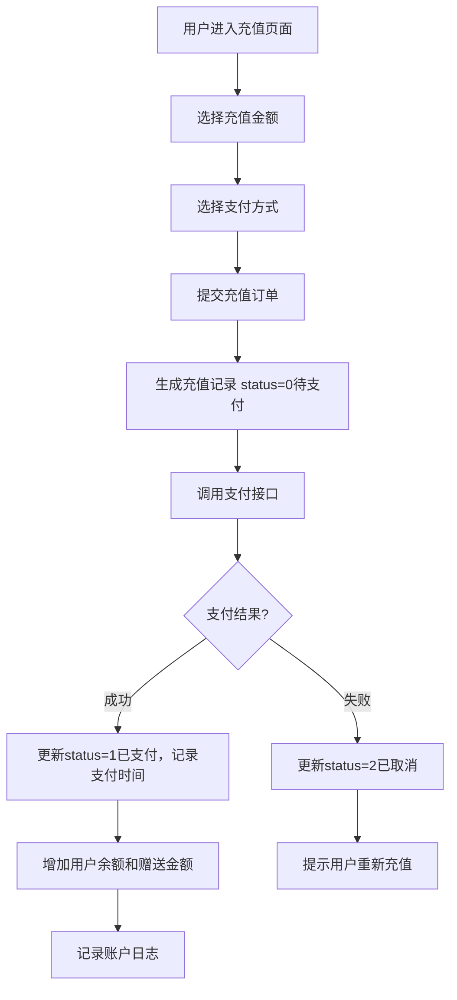
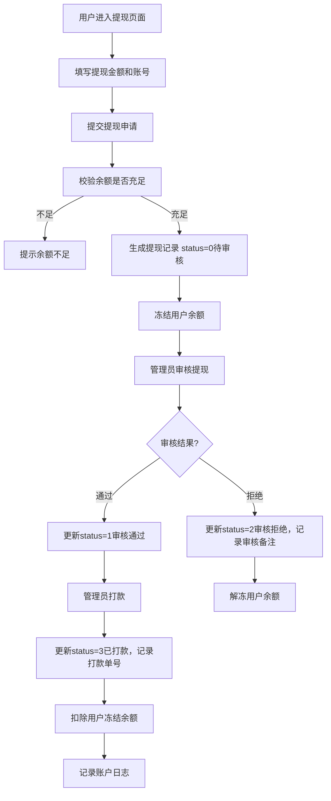
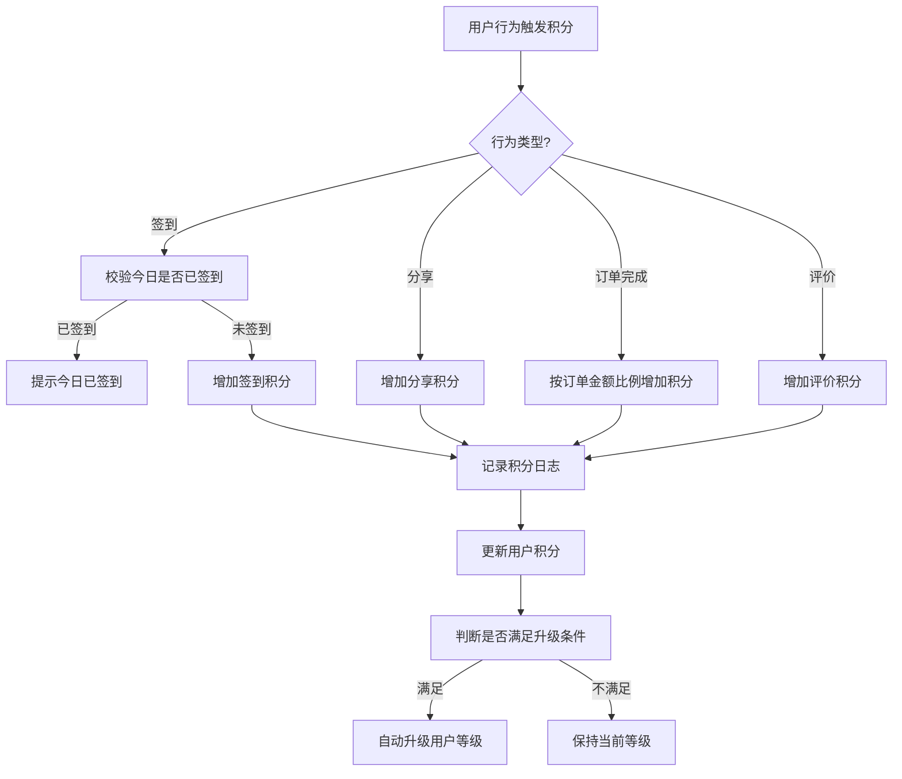

# 用户中心

## 1. 页面概述

用户中心模块提供商城用户的个人中心能力，包括用户信息管理、收货地址、用户等级、积分系统、优惠券、收藏关注、充值提现、账户日志等核心功能。模块同时提供管理端接口（管理员查看和操作用户数据）和用户端接口（用户管理自己的账户）。

### 核心功能
- 用户信息：查看和修改个人信息
- 收货地址：地址的增删改查，默认地址管理
- 用户等级：等级体系、升级进度、等级权益
- 积分系统：积分获取（签到/分享/消费）、积分日志、积分规则
- 优惠券：我的优惠券、领取优惠券
- 收藏关注：商品收藏、商品关注
- 充值管理：充值记录、人工补单
- 提现管理：提现申请、审核、打款、重试
- 账户日志：余额变动记录、导出
- 通知管理：站内信通知、已读/全部已读

### 子模块清单
| 子模块 | 控制器 | 说明 |
|--------|--------|------|
| 用户中心 | UserCenterController | 用户信息、等级、充值、提现、地址、账户日志 |
| 收货地址 | AddressController | 用户端地址CRUD |
| 收藏关注 | CollectController | 用户端商品收藏/关注 |
| 用户收藏 | FavoriteController | 管理端用户收藏查看 |
| 用户等级 | LevelController | 用户端等级列表、进度、通知 |
| 积分日志 | PointLogController | 管理端积分日志、手动调整、规则配置 |
| 用户积分 | UserPointController | 用户端签到、分享、我的积分 |
| 用户优惠券 | UserCouponController | 用户端优惠券列表、领取 |

### 管理端接口
| 接口 | 说明 |
|------|------|
| GET /admin/user-center/levels | 用户等级列表 |
| POST /admin/user-center/levels | 新增用户等级 |
| PUT /admin/user-center/levels/{id} | 编辑用户等级 |
| DELETE /admin/user-center/levels/{id} | 删除用户等级 |
| GET /admin/user-center/recharges | 充值记录列表 |
| POST /admin/user-center/recharges/{id}/confirm | 人工补单确认 |
| GET /admin/user-center/withdraws | 提现管理列表 |
| POST /admin/user-center/withdraws/{id}/audit | 提现审核 |
| POST /admin/user-center/withdraws/{id}/pay | 提现打款 |
| POST /admin/user-center/withdraws/{id}/retry | 提现重试 |
| GET /admin/user-center/withdraws/settings | 提现设置 |
| PUT /admin/user-center/withdraws/settings | 保存提现设置 |
| GET /admin/user-center/addresses | 收货地址列表 |
| GET /admin/user-center/account-logs | 账户日志列表 |
| GET /admin/user-center/account-logs/export | 账户日志导出 |
| GET /admin/user-points | 用户积分列表 |
| POST /admin/user-points | 手动调整积分 |
| GET /admin/user-points/config | 积分配置 |
| PUT /admin/user-points/config | 保存积分配置 |
| GET /admin/user-points/rules | 积分规则列表 |
| GET /admin/user-favorites | 用户收藏列表 |
| DELETE /admin/user-favorites/{id} | 删除用户收藏 |

### 用户端接口
| 接口 | 说明 |
|------|------|
| GET /user/center | 用户中心数据 |
| GET /user/info | 用户信息 |
| PUT /user/info | 修改用户信息 |
| GET /user/addresses | 收货地址列表 |
| POST /user/addresses | 新增收货地址 |
| PUT /user/addresses/{id} | 编辑收货地址 |
| DELETE /user/addresses/{id} | 删除收货地址 |
| GET /user/levels | 用户等级列表 |
| GET /user/level-progress | 等级升级进度 |
| GET /user/coupons | 我的优惠券 |
| POST /user/coupons/receive | 领取优惠券 |
| GET /user/points/my | 我的积分 |
| POST /user/points/sign | 签到获取积分 |
| POST /user/points/share | 分享获取积分 |
| GET /user/collects | 我的收藏 |
| POST /user/collects | 添加收藏 |
| POST /user/collects/cancel | 取消收藏 |
| DELETE /user/collects/{id} | 删除收藏 |
| GET /user/notifications | 通知列表 |
| PUT /user/notifications/{id}/read | 标记已读 |
| POST /user/notifications/read-all | 全部已读 |

### 使用场景
1. 用户查看和修改个人信息
2. 用户管理收货地址
3. 用户查看等级和升级进度
4. 用户签到和分享获取积分
5. 用户查看和领取优惠券
6. 用户收藏商品
7. 用户充值和提现
8. 用户查看账户余额变动日志
9. 管理员查看用户等级、充值、提现、积分、收藏数据
10. 管理员人工补单和提现审核打款

## 2. API接口清单

### 管理端-用户等级
| 方法 | 路径 | 控制器方法 | 说明 |
|------|------|-----------|------|
| GET | /api/v1/admin/user-center/levels | UserCenterController@levels | 用户等级列表 |
| POST | /api/v1/admin/user-center/levels | UserCenterController@levelStore | 新增用户等级 |
| PUT | /api/v1/admin/user-center/levels/{id} | UserCenterController@levelUpdate | 编辑用户等级 |
| DELETE | /api/v1/admin/user-center/levels/{id} | UserCenterController@levelDestroy | 删除用户等级 |

### 管理端-充值管理
| 方法 | 路径 | 控制器方法 | 说明 |
|------|------|-----------|------|
| GET | /api/v1/admin/user-center/recharges | UserCenterController@recharges | 充值记录列表 |
| POST | /api/v1/admin/user-center/recharges/{id}/confirm | UserCenterController@rechargeConfirm | 人工补单确认 |

### 管理端-提现管理
| 方法 | 路径 | 控制器方法 | 说明 |
|------|------|-----------|------|
| GET | /api/v1/admin/user-center/withdraws | UserCenterController@withdraws | 提现管理列表 |
| POST | /api/v1/admin/user-center/withdraws/{id}/audit | UserCenterController@withdrawAudit | 提现审核 |
| POST | /api/v1/admin/user-center/withdraws/{id}/pay | UserCenterController@withdrawPay | 提现打款 |
| POST | /api/v1/admin/user-center/withdraws/{id}/retry | UserCenterController@withdrawRetry | 提现重试 |
| GET | /api/v1/admin/user-center/withdraws/settings | UserCenterController@withdrawSettings | 提现设置 |
| PUT | /api/v1/admin/user-center/withdraws/settings | UserCenterController@withdrawSettings | 保存提现设置 |

### 管理端-收货地址
| 方法 | 路径 | 控制器方法 | 说明 |
|------|------|-----------|------|
| GET | /api/v1/admin/user-center/addresses | UserCenterController@addresses | 收货地址列表 |

### 管理端-账户日志
| 方法 | 路径 | 控制器方法 | 说明 |
|------|------|-----------|------|
| GET | /api/v1/admin/user-center/account-logs | UserCenterController@accountLogs | 账户日志列表 |
| GET | /api/v1/admin/user-center/account-logs/export | UserCenterController@accountLogsExport | 账户日志导出 |

### 管理端-用户积分
| 方法 | 路径 | 控制器方法 | 说明 |
|------|------|-----------|------|
| GET | /api/v1/admin/user-points | PointLogController@index | 积分日志列表 |
| POST | /api/v1/admin/user-points | PointLogController@store | 手动调整积分 |
| GET | /api/v1/admin/user-points/config | PointLogController@config | 积分配置 |
| PUT | /api/v1/admin/user-points/config | PointLogController@config | 保存积分配置 |
| GET | /api/v1/admin/user-points/rules | PointLogController@rules | 积分规则列表 |

### 管理端-用户收藏
| 方法 | 路径 | 控制器方法 | 说明 |
|------|------|-----------|------|
| GET | /api/v1/admin/user-favorites | FavoriteController@index | 用户收藏列表 |
| DELETE | /api/v1/admin/user-favorites/{id} | FavoriteController@destroy | 删除用户收藏 |

### 用户端-用户中心
| 方法 | 路径 | 控制器方法 | 说明 |
|------|------|-----------|------|
| GET | /api/v1/user/center | UserCenterController@center | 用户中心数据 |
| GET | /api/v1/user/info | UserCenterController@info | 用户信息 |
| PUT | /api/v1/user/info | UserCenterController@updateInfo | 修改用户信息 |

### 用户端-收货地址
| 方法 | 路径 | 控制器方法 | 说明 |
|------|------|-----------|------|
| GET | /api/v1/user/addresses | AddressController@lists | 收货地址列表 |
| POST | /api/v1/user/addresses | AddressController@add | 新增收货地址 |
| PUT | /api/v1/user/addresses/{id} | AddressController@edit | 编辑收货地址 |
| DELETE | /api/v1/user/addresses/{id} | AddressController@delete | 删除收货地址 |
| GET | /api/v1/user/addresses/{id} | AddressController@detail | 收货地址详情 |

### 用户端-用户等级
| 方法 | 路径 | 控制器方法 | 说明 |
|------|------|-----------|------|
| GET | /api/v1/user/levels | LevelController@index | 用户等级列表 |
| GET | /api/v1/user/level-progress | LevelController@progress | 等级升级进度 |

### 用户端-用户优惠券
| 方法 | 路径 | 控制器方法 | 说明 |
|------|------|-----------|------|
| GET | /api/v1/user/coupons | UserCouponController@lists | 我的优惠券 |
| POST | /api/v1/user/coupons/receive | UserCouponController@receive | 领取优惠券 |

### 用户端-用户积分
| 方法 | 路径 | 控制器方法 | 说明 |
|------|------|-----------|------|
| GET | /api/v1/user/points/my | UserPointController@myPoints | 我的积分 |
| POST | /api/v1/user/points/sign | UserPointController@sign | 签到获取积分 |
| POST | /api/v1/user/points/share | UserPointController@share | 分享获取积分 |

### 用户端-收藏关注
| 方法 | 路径 | 控制器方法 | 说明 |
|------|------|-----------|------|
| GET | /api/v1/user/collects | CollectController@lists | 我的收藏 |
| POST | /api/v1/user/collects | CollectController@add | 添加收藏 |
| POST | /api/v1/user/collects/cancel | CollectController@cancel | 取消收藏 |
| DELETE | /api/v1/user/collects/{id} | CollectController@delete | 删除收藏 |

### 用户端-通知管理
| 方法 | 路径 | 控制器方法 | 说明 |
|------|------|-----------|------|
| GET | /api/v1/user/notifications | LevelController@notifications | 通知列表 |
| PUT | /api/v1/user/notifications/{id}/read | LevelController@readNotification | 标记已读 |
| POST | /api/v1/user/notifications/read-all | LevelController@readAllNotifications | 全部已读 |

## 3. 请求参数

### 新增用户等级
| 参数 | 类型 | 必填 | 说明 |
|------|------|------|------|
| name | string | 是 | 等级名称 |
| level | int | 是 | 等级值（0普通，1银卡，2金卡...） |
| discount | decimal | 是 | 折扣率（%），100表示无折扣 |
| benefits | object | 否 | 等级权益（JSON） |
| upgrade_points | int | 是 | 升级所需积分 |
| is_default | int | 否 | 是否默认等级 |
| sort | int | 否 | 排序 |
| status | int | 否 | 1启用，0禁用 |

### 人工补单确认
| 参数 | 类型 | 必填 | 说明 |
|------|------|------|------|
| id | int | 是 | 充值记录ID（URL路径参数） |
| admin_remark | string | 否 | 管理员备注 |

### 提现审核
| 参数 | 类型 | 必填 | 说明 |
|------|------|------|------|
| id | int | 是 | 提现记录ID（URL路径参数） |
| status | int | 是 | 审核结果：1通过，2拒绝 |
| audit_remark | string | 否 | 审核备注 |

### 手动调整积分
| 参数 | 类型 | 必填 | 说明 |
|------|------|------|------|
| user_id | int | 是 | 用户ID |
| points | int | 是 | 积分变动值（正数增加，负数减少） |
| type | string | 是 | 变动类型：manual人工调整 |
| description | string | 否 | 变动说明 |

### 新增收货地址
| 参数 | 类型 | 必填 | 说明 |
|------|------|------|------|
| name | string | 是 | 收货人姓名 |
| mobile | string | 是 | 收货人手机号 |
| province_id | int | 是 | 省份ID |
| city_id | int | 是 | 城市ID |
| district_id | int | 是 | 区县ID |
| detail | string | 是 | 详细地址 |
| is_default | int | 否 | 是否默认地址：1是，0否 |

### 领取优惠券
| 参数 | 类型 | 必填 | 说明 |
|------|------|------|------|
| coupon_id | int | 是 | 优惠券ID |

### 添加收藏
| 参数 | 类型 | 必填 | 说明 |
|------|------|------|------|
| goods_id | int | 是 | 商品ID |

## 4. 返回示例

### 用户中心数据
```json
{
  "code": 200,
  "message": "success",
  "data": {
    "user": {
      "id": 2,
      "mobile": "133001330001",
      "nickname": "测试用户1",
      "avatar": null,
      "status": 1,
      "balance": "55.00",
      "points": 2015,
      "level_id": 2,
      "created_at": "2026-09-01 16:47:05"
    },
    "order_count": {"pending_pay": 0, "pending_ship": 0, "pending_receive": 0, "completed": 0},
    "coupon_count": 0,
    "collect_count": 1
  },
  "timestamp": 1788343242
}
```

### 用户等级列表
```json
{
  "code": 200,
  "message": "success",
  "data": {
    "list": [
      {
        "id": 1,
        "name": "普通会员",
        "level": 0,
        "discount": "100.00",
        "benefits": "{\"discount\":100,\"free_shipping\":false}",
        "upgrade_points": 0,
        "is_default": 1,
        "sort": 1,
        "status": 1,
        "user_count": 10
      }
    ],
    "total": 4
  },
  "timestamp": 1788343242
}
```

### 等级升级进度
```json
{
  "code": 200,
  "message": "success",
  "data": {
    "current_level": {
      "id": 2,
      "name": "银卡会员",
      "level": 1,
      "discount": "95.00",
      "benefits": "{\"discount\":95,\"free_shipping\":true}",
      "upgrade_points": 1000
    },
    "next_level": {
      "id": 3,
      "name": "金卡会员",
      "level": 2,
      "discount": "90.00",
      "upgrade_points": 5000
    },
    "current_points": 2015,
    "progress": 40.3,
    "points_needed": 2985
  },
  "timestamp": 1788343242
}
```

### 我的积分
```json
{
  "code": 200,
  "message": "success",
  "data": {
    "points": 2015,
    "today_signed": true,
    "logs": [
      {
        "id": 4,
        "user_id": 2,
        "points": 5,
        "type": "share",
        "description": "分享商品",
        "created_at": "2026-09-02 03:29:17"
      }
    ]
  },
  "timestamp": 1788343242
}
```

### 充值记录列表
```json
{
  "code": 200,
  "message": "success",
  "data": {
    "list": [
      {
        "id": 2,
        "user_id": 2,
        "amount": "50.00",
        "give_amount": "5.00",
        "pay_type": "wechat",
        "pay_no": "WX20260902001",
        "status": 1,
        "paid_at": "2026-09-02 03:09:07",
        "admin_remark": null,
        "nickname": "测试用户1",
        "mobile": "133001330001"
      }
    ],
    "total": 1,
    "stats": {"total_amount": 50.00, "total_count": 1, "pending_count": 0}
  },
  "timestamp": 1788343242
}
```

### 提现管理列表
```json
{
  "code": 200,
  "message": "success",
  "data": {
    "list": [
      {
        "id": 1,
        "user_id": 2,
        "merchant_id": 0,
        "type": 1,
        "amount": "100.00",
        "fee": "0.00",
        "actual_amount": "100.00",
        "pay_type": "alipay",
        "pay_account": "test@alipay.com",
        "status": 0,
        "audit_remark": null,
        "pay_no": null,
        "nickname": "测试用户1",
        "mobile": "133001330001"
      }
    ],
    "total": 1,
    "stats": {"pending_count": 1, "paid_count": 0, "total_amount": 100.00}
  },
  "timestamp": 1788343242
}
```

## 5. HTTP状态码

| 状态码 | 说明 |
|--------|------|
| 200 | 请求成功 |
| 400 | 业务错误（重复签到、积分不足、提现状态错误） |
| 401 | 未认证 |
| 404 | 资源不存在 |
| 422 | 请求参数验证失败 |

## 6. 字段映射表

### user_levels表（用户等级）
| 字段 | 类型 | 说明 |
|------|------|------|
| id | bigint | 主键 |
| name | varchar(50) | 等级名称 |
| level | int | 等级值（0普通，1银卡，2金卡...） |
| discount | decimal(5,2) | 折扣率（%） |
| benefits | text | 等级权益（JSON） |
| upgrade_points | int | 升级所需积分 |
| is_default | tinyint | 是否默认等级 |
| sort | int | 排序 |
| status | tinyint | 1启用，0禁用 |
| created_at | timestamp | 创建时间 |
| updated_at | timestamp | 更新时间 |

### user_recharges表（充值记录）
| 字段 | 类型 | 说明 |
|------|------|------|
| id | bigint | 主键 |
| user_id | bigint | 用户ID |
| amount | decimal(12,2) | 充值金额 |
| give_amount | decimal(12,2) | 赠送金额 |
| pay_type | varchar(20) | 支付方式（wechat/alipay） |
| pay_no | varchar(50) | 支付单号 |
| status | tinyint | 状态：0待支付，1已支付，2已取消 |
| paid_at | timestamp | 支付时间 |
| admin_remark | varchar(255) | 管理员备注 |
| created_at | timestamp | 创建时间 |
| updated_at | timestamp | 更新时间 |

### user_withdraws表（提现记录）
| 字段 | 类型 | 说明 |
|------|------|------|
| id | bigint | 主键 |
| user_id | bigint | 用户ID |
| merchant_id | bigint | 商家ID（0表示用户提现） |
| type | tinyint | 类型：1用户提现，2商家提现 |
| amount | decimal(12,2) | 提现金额 |
| fee | decimal(12,2) | 手续费 |
| actual_amount | decimal(12,2) | 实际到账金额 |
| pay_type | varchar(20) | 提现方式（alipay/wechat/bank） |
| pay_account | varchar(100) | 提现账号 |
| status | tinyint | 状态：0待审核，1审核通过，2审核拒绝，3已打款 |
| audit_remark | varchar(255) | 审核备注 |
| pay_no | varchar(50) | 打款单号 |
| created_at | timestamp | 创建时间 |
| updated_at | timestamp | 更新时间 |

### user_addresses表（收货地址）
| 字段 | 类型 | 说明 |
|------|------|------|
| id | bigint | 主键 |
| user_id | bigint | 用户ID |
| name | varchar(50) | 收货人姓名 |
| mobile | varchar(20) | 收货人手机号 |
| province_id | int | 省份ID |
| city_id | int | 城市ID |
| district_id | int | 区县ID |
| province_name | varchar(50) | 省份名称（冗余） |
| city_name | varchar(50) | 城市名称（冗余） |
| district_name | varchar(50) | 区县名称（冗余） |
| detail | varchar(255) | 详细地址 |
| is_default | tinyint | 是否默认地址：1是，0否 |
| created_at | timestamp | 创建时间 |
| updated_at | timestamp | 更新时间 |

### account_logs表（账户日志）
| 字段 | 类型 | 说明 |
|------|------|------|
| id | bigint | 主键 |
| user_id | bigint | 用户ID |
| type | tinyint | 类型：1充值，2消费，3退款，4提现退回，5人工调整 |
| amount | decimal(12,2) | 变动金额 |
| balance_before | decimal(12,2) | 变动前余额 |
| balance_after | decimal(12,2) | 变动后余额 |
| order_no | varchar(50) | 关联订单号 |
| remark | varchar(255) | 备注 |
| created_at | timestamp | 创建时间 |

### point_logs表（积分日志）
| 字段 | 类型 | 说明 |
|------|------|------|
| id | bigint | 主键 |
| user_id | bigint | 用户ID |
| points | int | 积分变动值 |
| type | varchar(20) | 变动类型（sign签到/share分享/order订单/manual人工） |
| description | varchar(255) | 变动说明 |
| created_at | timestamp | 创建时间 |

### user_collects表（用户收藏）
| 字段 | 类型 | 说明 |
|------|------|------|
| id | bigint | 主键 |
| user_id | bigint | 用户ID |
| goods_id | bigint | 商品ID |
| created_at | timestamp | 创建时间 |

### user_coupons表（用户优惠券）
| 字段 | 类型 | 说明 |
|------|------|------|
| id | bigint | 主键 |
| user_id | bigint | 用户ID |
| coupon_id | bigint | 优惠券ID |
| status | tinyint | 状态：0未使用，1已使用，2已过期 |
| used_at | timestamp | 使用时间 |
| created_at | timestamp | 创建时间 |

## 7. 操作流程

### 用户充值流程


### 用户提现流程


### 积分获取流程


## 8. 权限控制

- 认证方式：Sanctum Token认证
- 路由中间件：auth:sanctum
- 管理端接口需管理员登录
- 用户端接口需用户登录
- 用户只能操作自己的数据（通过user_id过滤）
- 人工补单、提现审核打款、手动调整积分为高权限操作，需管理员权限
- 无细粒度权限点（permissions表不存在）

## 9. 关联模块

### 依赖模块
| 模块 | 依赖内容 | 关联字段 |
|------|---------|---------|
| 用户管理 | 用户信息 | user_recharges.user_id → users.id |
| 订单管理 | 订单信息 | account_logs.order_no → orders.order_no |
| 商品管理 | 商品信息 | user_collects.goods_id → products.id |
| 营销管理 | 优惠券信息 | user_coupons.coupon_id → coupons.id |
| 支付管理 | 支付接口 | 充值调用支付接口 |

### 被依赖模块
| 模块 | 使用方式 |
|------|---------|
| 订单模块 | 读取用户等级折扣、用户积分、收货地址 |
| 支付模块 | 充值回调更新充值记录和用户余额 |
| 营销模块 | 优惠券领取记录到user_coupons表 |
| 用户端 | 展示用户中心数据、等级、积分、优惠券、收藏 |

## 10. 验收清单

### 功能验收
- [x] 管理端-用户等级列表接口正常（GET /user-center/levels）
- [x] 管理端-充值记录列表接口正常（GET /user-center/recharges）
- [x] 管理端-人工补单确认接口正常（POST /user-center/recharges/{id}/confirm）
- [x] 管理端-提现管理列表接口正常（GET /user-center/withdraws）
- [x] 管理端-提现审核接口正常（POST /user-center/withdraws/{id}/audit）
- [x] 管理端-提现打款接口正常（POST /user-center/withdraws/{id}/pay）
- [x] 管理端-提现重试接口正常（POST /user-center/withdraws/{id}/retry）
- [x] 管理端-收货地址列表接口正常（GET /user-center/addresses）
- [x] 管理端-账户日志列表接口正常（GET /user-center/account-logs）
- [x] 管理端-用户积分列表接口正常（GET /user-points）
- [x] 管理端-手动调整积分接口正常（POST /user-points）
- [x] 管理端-用户收藏列表接口正常（GET /user-favorites）
- [x] 用户端-用户中心接口正常（GET /user/center）
- [x] 用户端-用户信息接口正常（GET/PUT /user/info）
- [x] 用户端-收货地址CRUD接口正常（/user/addresses）
- [x] 用户端-用户等级列表接口正常（GET /user/levels）
- [x] 用户端-等级升级进度接口正常（GET /user/level-progress）
- [x] 用户端-我的优惠券接口正常（GET /user/coupons）
- [x] 用户端-领取优惠券接口正常（POST /user/coupons/receive）
- [x] 用户端-我的积分接口正常（GET /user/points/my）
- [x] 用户端-签到获取积分接口正常（POST /user/points/sign）
- [x] 用户端-分享获取积分接口正常（POST /user/points/share）
- [x] 用户端-收藏CRUD接口正常（/user/collects）
- [x] 用户端-通知管理接口正常（/user/notifications）

### 数据验收
- [x] user_levels表结构完整（4条默认数据：普通/银卡/金卡/钻石）
- [x] user_recharges表结构完整（充值记录，含赠送金额）
- [x] user_withdraws表结构完整（提现记录，含手续费和实际到账金额）
- [x] user_addresses表结构完整（省市区三级联动，默认地址）
- [x] account_logs表结构完整（变动前后余额记录，5种类型）
- [x] point_logs表结构完整（签到/分享/订单/人工4种类型）
- [x] user_collects表结构完整（用户商品收藏）
- [x] user_coupons表结构完整（用户优惠券，3种状态）

### 安全验收
- [x] 所有接口需auth:sanctum认证
- [x] 用户只能操作自己的数据（通过user_id过滤）
- [x] 提现金额校验（余额不足时拒绝）
- [x] 签到防重复（今日已签到时拒绝）
- [x] 人工补单和提现审核需管理员权限
- [x] 参数验证（必填字段/类型校验/金额范围）

## 11. 常见问题

| 问题 | 原因 | 解决方案 |
|------|------|----------|
| 充值后余额未增加 | 支付回调未处理或充值记录status未更新 | 检查支付回调，确认充值记录status=1已支付，调用人工补单确认 |
| 提现审核通过后余额未扣除 | 提现打款接口未调用 | 审核通过后需调用提现打款接口，才会扣除用户余额 |
| 签到提示今日已签到 | 签到防重复机制 | 正常行为，每个用户每天只能签到一次 |
| 等级升级进度不正确 | 积分未及时更新或等级配置错误 | 检查user_levels表的upgrade_points配置，确认用户积分正确 |
| 收货地址列表为空 | 用户未添加地址 | 用户端调用新增地址接口添加收货地址 |
| 我的优惠券为空 | 用户未领取优惠券 | 用户端调用领取优惠券接口领取 |
| 收藏商品失败 | 商品不存在或已下架 | 检查goods_id是否正确，确认商品status=1 |
| 提现金额超过余额 | 提现金额校验 | 前端应限制提现金额不超过用户可用余额 |
| 账户日志导出失败 | 导出接口参数错误 | 检查导出接口的时间范围和筛选条件 |
| 积分手动调整后用户积分未更新 | PointLogController的store方法未同步更新users表 | 检查store方法，确认调整积分后同步更新users.points字段 |
